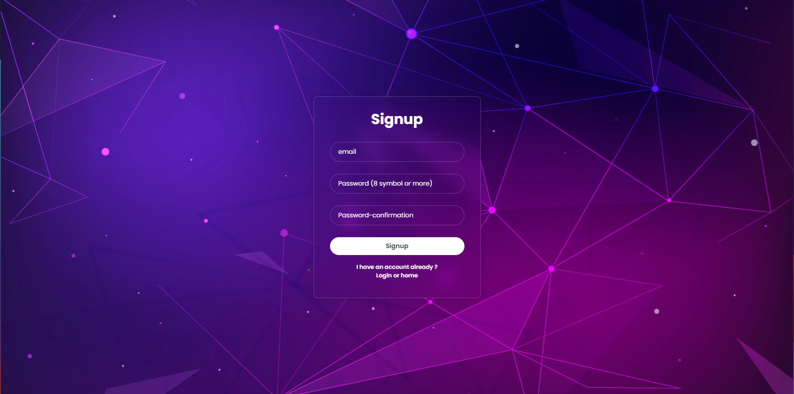

# <span style="color: #612486">Responsive_Shopping_Website </span>
### <span style="color: #8f5000;">( **Images used are sourced from a previous version of a website named "shopbyrnie"** )</span>
### <span style="color: #3498db;">Technologies : </span>
- The website is coded using:
  - JavaScript
  - HTML
  - CSS
  and Sass to provide an engaging user interface.
  - Node.js for Backend
## <span style="color: #5d7bc7">1_Getting Started</span>

* To start, Open the terminal and follow these steps:
```bash
cd NodeConnectShop
```
```bash
npm install
```
### Frontend Setup
  
```bash
npm install -g live-server
```
```bash
live-server --port=5501
```
### Backend Setup
Open a new terminal and follow these steps:
```bash
cd NodeConnectShop/backend
```

Make sure you have `nodemon` installed to run the Node.js server. If you haven't installed it yet, you can do so by running the following command:

```bash
sudo npm install -g nodemon
```
```bash
nodemon app.js 
```
## <span style="color: #934213">2_System Architecture</span>

### Backend API
- The backend operates on http://localhost:3000, managing the core functionalities of the shopping website.


### Frontend
- The frontend is hosted at http://localhost:5501/frontend/public/src/index.html, providing users with an interactive and dynamic interface to access features.


## <span style="color: #7669d1">3_Features</span> :
### 1. Registration
- Intuitive form for quick enrollment.



### 2. Secure Login
- Protects sensitive data with email and password.
- Users can choose whether the session expires upon closing the browser or at a later time through the "Remember me" option.


### 3. Password Modification
- Easy password updates but this functionality is the only one not to be secure


### 4. Personalized Interface
- Unique user with custom avatars 


### 5. Logout
- Hassle-free logout to ensure user privacy.


### 6. Avatar Upload
- Users can upload their own avatars through a functionality.


### 7. Secure Pages (Dreses and Tops)
- Pages "Dress" and "Top" are secure even when not logged in, 


